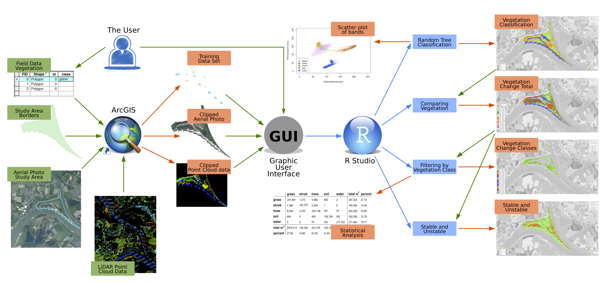

***
### Introduction
This website contains a tutorial on how to simply classify vegetation change based on [spectral imagery](B_specimg.html), which can optionally be combined with [LiDAR data](B_LiDAR.html). These instructions are meant to be read while using the software provided along with it. This software can be found [here](https://github.com/floodplainsuccession/classificationapplication). Additional information about vegetation succession, classification methods, and data types are provided for a better understanding of the underlying processes. As an example, a possible result of a classification can be seen [here](results.html). 

The presented method is used for floodplain areas in The Netherlands. In these areas, the change of the vegetation over time is of interest. However, the software can also be used for different areas and purposes if the user sees this fitting. In such cases, the script might need some adapting. This project was carried out by geographical information science students of Wageningen University as an academic consultancy training.

***
### Why do we need to know the Vegetation Succesion in Floodplains?
In some floodplain areas in The Netherlands, large grazers are used to control and influence the vegetation. This helps to keep these areas free of obstacles to ensure the water can run off easily during flooding occasions. Maps with information about the vegetation cover are crucial to determine the actual impact of the grazers on the vegetation. This website shows an easy and reproducible approach to create vegetation maps from spectral imagery. Additional information about the need to know the how these grazers affect the vegetation can be found [here](B_project.html).

***
### Classifying Vegetation and Calculating the Change Using this Software.
Before the user can start classifying the vegetation, they will need to have a areal photograph of the area with a blue, green, red and near infrared band. If only a vegetation classification is wanted, only one year is necessary. When the user wants to assess the vegetation change, two years are needed. For the area, a training dataset is needed. For more information on how to create these using ArcGIS, see [this page](T_preproc_poly.html).

If the user wishes to use [LiDAR data](B_LiDAR.html) to enhance their accuracy, they would need to have a preprocessed LiDAR dataset available for each year as well. For more information on how to create these, see [this page](T_preproc_LiDAR.html).

For general users, it is advised to use the *graphical user interface* (GUI), which will allow them to simply define their input, and choose which data they wish as output. For more information on the GUI, see [here](GUI.html).

If the user has some experience with scripting in R, or wishes to learn how to create the maps himself, it is possible for them to do so. A tutorial is available on this website under the tutorial button at the top right. Using an example study site, Klompenwaard near Nijmegen, and a method to identify three vegetation types, it is explained in detail how this can be done without using the application. However, this tutorial is simplified for a better understanding for inexperienced users and is not identical to the application itself. 

The software as provided uses a few simple steps to [classify](B_class.html) the vegetation with a random forest method, and calculate the change. After the preprocessing as mentioned above, these steps are as follows:

1. Classifying the vegetation for each year: [Tutorial](T_veg_class.html)
2. Calculating the vegetation succession between the two years: [Tutorial](T_veg_change.html)
3. Calculating the vegetation change for each vegetation class: [Tutorial](T_change_sep.html)
4. Creating an interactive map of the above results: [Tutorial](T_Leaflet.html)
5. Statistically assessing the vegetation cover and change: [Tutorial](T_change_stat.html)

For a better understanding, the workflow of the whole process is visualized below. It shows used software and datasets for specific tasks and how the outputs are connected to each other.

***

***
